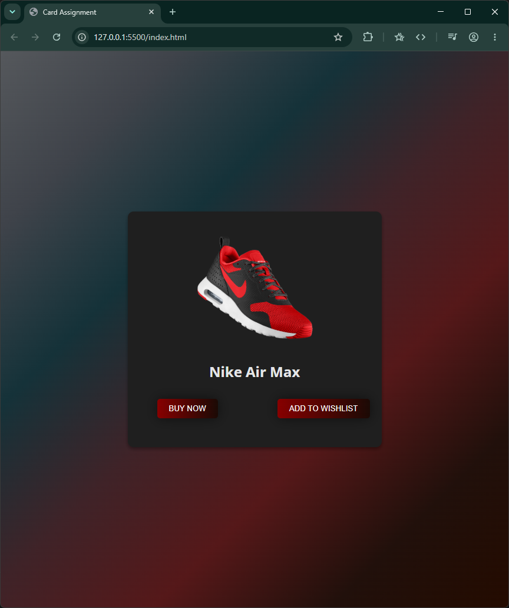

Nike Air Max Product Card 👟

A simple product card UI built from scratch using HTML and CSS. The project focuses on creating a visually appealing product card with CSS gradients, hover animations, transitions, and positioning.

✨ Features

* Dark gradient background
* Centered product card layout
* Nike Air Max product image
* Smooth image zoom effect on hover
* Animated button hover effects
* Buy Now and Add to Wishlist buttons
* Google Fonts integration using Open Sans
* CSS gradients and box shadows for styling

🛠️ Technologies Used

* HTML5
* CSS3
* Google Fonts

🎨 CSS Concepts Used

This project was built to practice several CSS concepts, including:

* display: flex
* position: absolute
* transform: scale()
* transition
* linear-gradient()
* box-shadow
* object-fit
* Hover pseudo-class (:hover)

🚀 Getting Started

No additional dependencies or installation are required.

1. Clone or download the repository.
2. Make sure index.html, style.css, and shoe.png are in the same directory.
3. Open index.html in your browser.
4. Hover over the product image and buttons to see the CSS animations.

📌 Project Status

Completed — Front-end UI

The buttons are currently visual elements and do not have JavaScript functionality attached to them.

🔮 Possible Improvements

Future versions could include:

* JavaScript functionality for the buttons
* Responsive improvements for different screen sizes
* Product price and description
* Functional wishlist and shopping cart
* Additional product cards
* A complete product page

Preview

⸻

Built as a CSS & HTML practice project.